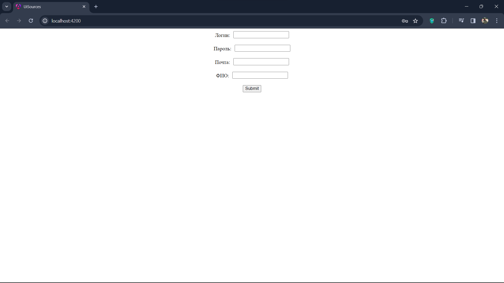

# Сервис по обработке заявок регистрации аккаунтов

## Stack
Java 21, Spring boot 3.2.4, Angular 17.3.2, Docker, JUnit 5, Mockito

## Frontend
Реализована форма для отправки регистрационных данных аккаунта на обработку

## Backend
Реализована микросервисная архитектура.
Для всех микросервисов были написаны тесты.
1) **account-service** - сервис обработки регистрационных данных пользователя, в рамках которой в БД сохраняется аккаунт и
далее запрос посылается на одобрение в сервис одобрения заявок
2) **request-processing-service** - сервис одобрения каких-либо заявок от пользователей. Процесс обработки заявки в результате
возвращает статус обработки и в зависимости от него посылается уведомление в сервис отправки уведомлений
3) **notification-service** - сервис отправки уведомлений пользователям. Реализована отправка по email по протоколу SMTP. 

## Docker
Для запуска приложения можно использовать файл **docker-compose.yml**
